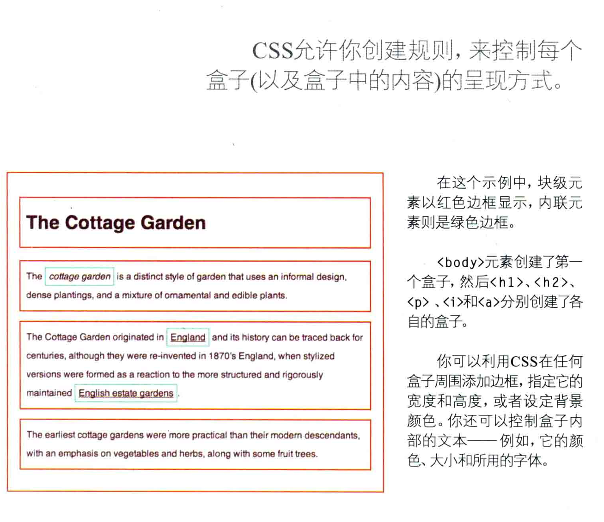
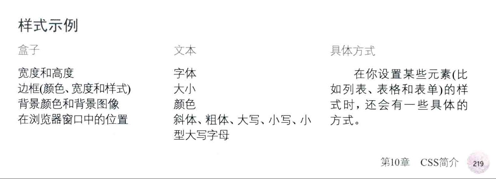
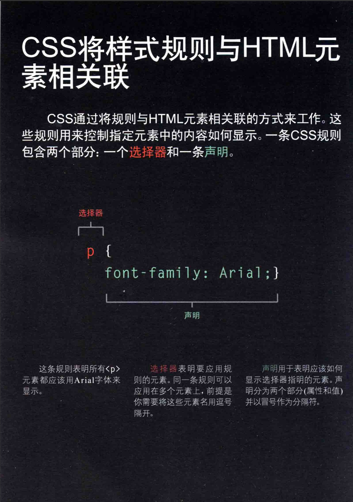
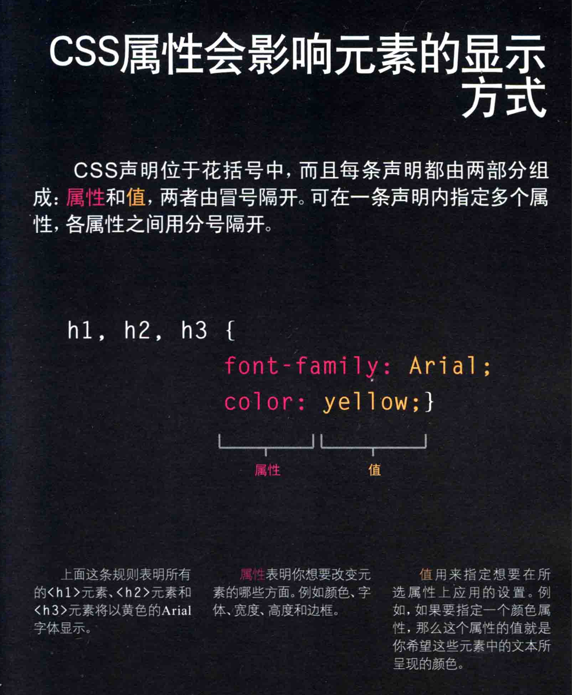
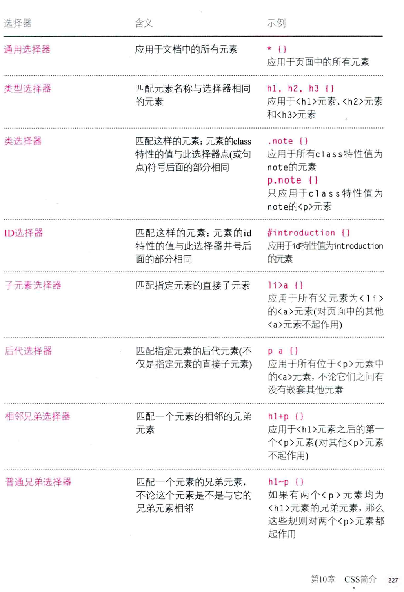
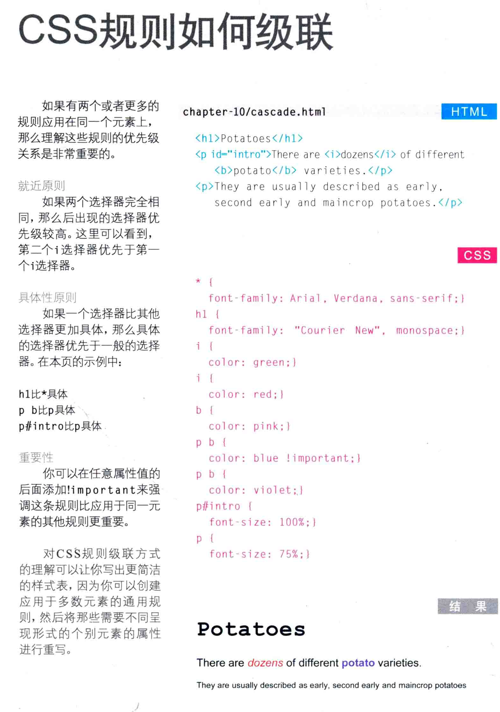

<!DOCTYPE CSS>
# CSS 装饰HTML元素，请努力把它想象成盒子吧！

-----------------
# 他应该具有以下属性

------------------------------------
# 你可以按照这个语法抒写CSS

被选择的对象 {
    属性:值;
}
-----多个对象应用同一个样式-----------------
A , B{
    属性:值;
}
更改里面的各种属性，可以形成许多各种各样的样式，这取决于你的想象力

--------下面用示例介绍一下-------
首先在head标签中添加 <link href="style.css" rel="stylesheet" type="text/css">
<link> 是空元素，这里用来指定CSS样式文件的位置
href 属性指定样式文件的位置
rel 属性指定样式文件的关系relative，这里指定样式文件是样式表
type 样式文件的类型，这里指定样式文件是CSS样式表
科普一下英语: background-color 背景颜色
rgb :red green blue 红绿蓝 三原色
height : 高度
width : 宽度
margin :外边距
padding : 内边距
border : 边框
font-size : 字体大小
font-family : 字体
font-weight : 字体粗细
font-style : 字体样式
text-align : 文本对齐

如果你想使用内部style样式表，那么你需要在<head>标签内添加<style>标签，并把样式放在里面。

 介绍了一下其他形式
比较常用的是 .class{}
和 #id{}

越具体越优先，可以加！在选中的标签前强调

为了简便，CSS 子级会继承一些父级属性
比如<body>指定了背景颜色，那么
也会继承这个颜色
指定了居中，那么子项目也会继承这个居中属性
但有一些影响美观的元素例外，你也可以使用 属性 ： inherit;强制使用父级属性
!(CSS 的bug)[CSS_bug.png] 原理与解决解释

-----------------CSS-----------------/颜色
CSS 颜色 是非常重要的一部分
