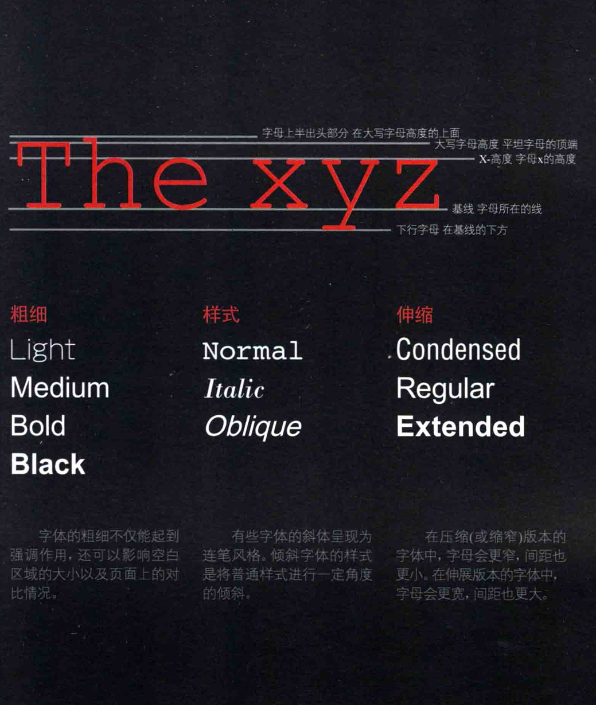

color 前景色
h1 {
    color: DarkCyan;;
}
h2 {
    color:#ee3e80;
}

p {
    color: rgb(100,100,90);
}
颜色的指定方法
第一种：
    直接写英语名
第二种：
    RGB: red green blue 的数值

    0-255
第三种:
    HEX:16进制 每两位对应RGB

第四种: HSLA
    HSL: Hue Saturation Lightness
    Hue: 色调
    Saturation: 饱和度
    Lightness: 亮度
    A: alpha 透明度

下面介绍几个常用的属性：
    1. background-color: 背景颜色
    迫不及待想试试了
新的英语单词属性：
对比度 contastic
透明度 opacity
rgba 的 a也是透明度哦！
alpha 透明度

CSS 3 引入了 HSL
色度 饱和度 明度
色度取值 0~ 360
饱和度取值 0~100 百分比
明度取值 0~100 百分比
HSLA HSL + 透明度

别忘了，还有之前学过的
margin 分割 不同组件的外面段落的间隙
padding 设置盒子边缘与其内部文本的间距

---------第十二章-文本--
文本大小与字形
粗体，斜体，大写，下划线
行间距。字母间距和单词间距

字体术语:
衬线字体SERIF 
    笔画末端有一些装饰
    称为衬线
    作用：用于长篇阅读

无衬线字体SANS-SERIF
    笔画末端没有装饰
    作用：小文本更加清晰

等宽字体MONOSPACE

    每个字母宽度都相等
    作用：精确对齐，用于显示代码

另外

font-family:字体名称;逗号分割读个字体，优先级从左到右，第一个字体不存在，则使用下一个，直到找到一个存在的字体。
font-size:字体大小;

默认字体大小16px
可以用百分比，计算按默认* 百分比计算
也可以用像素
或者em值 1.2em lem相当于一个m的宽度