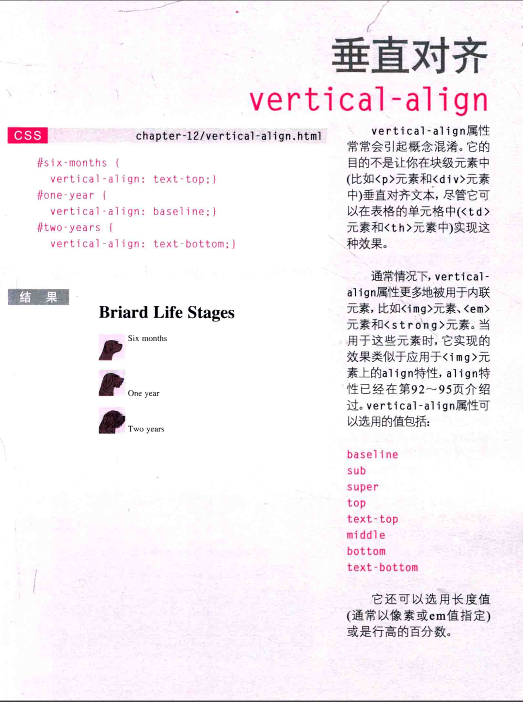

字体导入
@font-face{
    font-family: "字体名称";
    src: url("字体路径");

}
h1 ,h2 {
    font-family: "字体名称";

}
开源字体:
www.fontsquirrel.com
www.fontex.com
www.openfontlibrary.com

www.typekit.com
www.kernest.com
www.fontspring.com

www.google.com/webfonts

你应该准备多种格式字体
1.eot
2.woff
3.ttf/otf
4.svg

font-weight
粗体
font-weight:normal 正常
font-weight:bold 粗体
normal 是当整个body被应用了bold
部分还是可以normal'的

font-style  : normal 普通
font-style: italic 斜体 手写体
font-variant: olique 倾斜 角度

text-transform: uppercase 全大写
text-transform: lowercase 全小写
text-transform: capitalize 首字母大写
text-decoration: none 无修饰
text-decoration: underline 下划线
text-decoration: line-through 删除线
text-decoration: overline 上划线
text-decoration: blink 闪烁
通常没人用 blink 因为动态闪烁很烦人

line-height: 行高
 与 font-size 差距在行高多一个行间距阻隔上边距
行间距的初始值最好设定在
1.4em~1.5em 不要由像素给出，因为像素会随浏览器大小而改变

letter-spacing: 字母间距
word-spacing: 单词间距
默认间距0.25em
属性值应该由em决定
text-align
对齐方式
text-align: left;
向左对齐
text-align: right;
向右对齐
text-align: center; 
居中对齐
text-align: justify;
文本两端对齐
除了结尾。不允许有间隔

vertical-align: 
垂直对齐，但常用在内联对齐
baseline: 
垂直对齐 
长这样
图片
图片
图片 对齐

还有
text-top 上面
text-bottom 下面
sub super top middle bottom
也可以用百分数 em px 

文本缩进
text-indent:
    一般取像素或者em值
可以取负值把被那个移除

text-shadow
阴影
text-shadown: 阴影左右延伸长度,阴影上下延伸长度，[可选]长度模糊程度,颜色
text-shadow: 1px 2px 3px #113300

首字母或首行文本
:first-letter,
:first-line,
p.info:first-letter{
    font-size: 200%;
}
p.info:first-line{
    font-weight: bold;
}
科普： 从技术上看这不是属性，而是一个新元素
伪元素
后面还会介绍到
visited点过的
,hover 悬停的鼠标

链接样式
:link :visited
a:visited{
    设置访问后连接属性
}
a:link{
    设置未访问的属性
}

响应用户
:hover ,:active ,:focus
hover 悬停时显示的样式
触屏不行
:active
按下按钮时的形式
:focus
当你准备点击时 如tap选中
所有交互性控件都有这个
多个伪类 按以下顺序
:link 
:visited
:hover 悬停
:focus 焦点
:active

特性选择器
EXISTENCE(简单选择器)
[]
p[class]应用所有包含class的p元素
p[class="dog"]精确选中
p[class~="dog"] 匹配包含dog的p元素
p[attr^"d"]应用于特定的值，字母d开头
p[attr*="do"] 该特性值attr含有do
p[attr$="g"] 某个特性值以g为结尾
