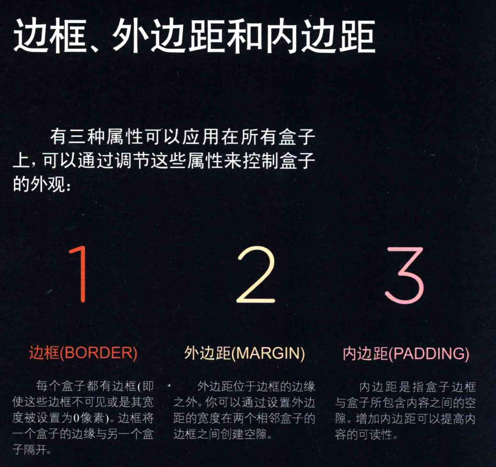

# 盒子
盒子的大小

</box>

div.box {
    height: 高;
    width: 宽;
}
常用单位是像素
但百分数 em也不错
从父级的大小做百分数
min-width, max-width
最小宽度 与最大宽度

min-height ,max-height

内容溢出
overflow: hidden;
把盒子溢出部分隐藏
overflow: scroll;
添加滚动条,查看溢出的内容
p.one{
    overflow: scroll;
}
p.two{
    overflow: hidden;
}
# overflow 是非常简便实用的，避免条重叠的现象

有三种属性
1. 边框 border
每个盒子都有边框，将一个盒子的边缘与
另一个和字隔开。
2. 外边距margin
外边距位于边框的边缘之外
设置外边距在两个 bolck  betweet cloes box

3. 内边距padding
box outside and include content
inprove padding to make content ore visible

if define width, then 
box border ,margin,padding will be added to width or height.

white space and line outside
the peace of the box can imporve clear

边框宽度
border-width: 
游侠的值 thin medium    thick
不可用百分数
border-top-width: 上边距宽度
border-right-width: 右边距宽度
border-bottom-width: 下边距宽度
border-left-width: 左边距宽度

也可以用 border-width: 2px 1px 1px 2px;
按上，右，下，左的顺序 我自己记得方法：记作钟表顺序 一
从 0点开始

border-style:
边框样式
控制盒子的边框
sloid 一条实线
dotted 点状
dashed 虚线
double 双线
 border-width: 是这条是线的框的宽度
groove 槽 围起来 雕入页面一般
ridge 槽 凸起
inset 凹入
outset 凸出

none 无边框

border-top-style: 边框样式
border-right-style: 边框样式
border-bottom-style: 边框样式
border-left-style: 边框样式

边框颜色 可以用 RGB 十六进制 或是CSS颜色名

一种边检的方式控制边框颜色
border-color: 颜色1 颜色2 颜色3 颜色4; 钟表顺序

也可以用hsl 但CSS3 以下的浏览器可能不支持

更方便的方法
border 实行允许你在一个属性中间指定边框的宽度，样式和颜色。
border :  宽度 样式 颜色;
border : 2px doted red;
padding 内边距，迎来指定元素的内部元素与边界之间的距离
常用像素作为单位。
也可以是百分比 或者 em
    如果已经指定了宽度，那么，宽度=宽度+内边距

    paddding-top: 上内边距;
    padding-right: 右内边距;
    padding-bottom: 下内边距;
    padding-left: 左内边距;
    或者简便写法 
        padding: 上内边距 右内边距 下内边距 左内边距; 钟表顺序

        
    padding不会被子元素继承
    对于每一个内边距的元素都需要指定padding属性

margin 外边距：
    margin 用来指定盒子之间的空隙，一般也是像素
    当然也可以实用百分数 em值

    如果一个盒子在另一个盒子之上】
    就会出现外边距折叠现象，只显示大的外边距

    如果指定了宽度
    那么外边距也会加载宽度上
    margin-top:
    margin-right:
    margin-bottom:
    margin-left:
    也可以: 
    margin:margin-top margin-right margin-bottom margin-left;

    当然你也许看到这种写法:
    margin: 10px 20px;
    意思是 左右都为10px 上下都20px

    应用：如果你想让一个盒子在页面上居中显示
    或者某个元素内居中显示
    可将left-margin right-margin设置为auto

    