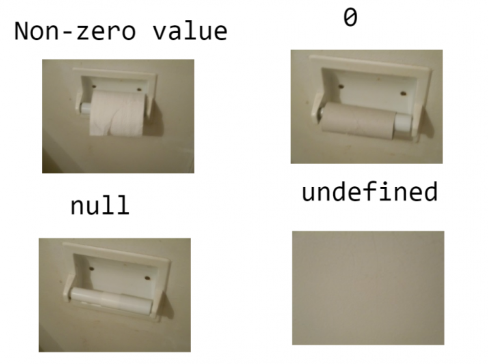

# 引用JS
    
#  导入文件JS
    
# 第一个项目
    
# // 注释快捷键 Ctrl + / 多行 shift alt +A 
    // 控制台 Shift+Enter 按键去输入多行代码
    // 当你的代码全都写在了 class 和 module 中时，
    // 你则可以将 
    // "use strict"; 这行代码省略掉。
<!-- 这一行代码是启用严格模式 -->
# let创建局变量
    let name = "Tom";
    let name= "Tom",
    id="1",
    school=" homesite';
    多个变量
    一个变量应该只被声明一次。
    JavaScript 的变量命名有两个限制：

        变量名称必须仅包含字母、数字、符号 $ 和 _。
        首字符必须非数字。
        apple 和 APPLE 的变量是不同的两个变量。
        允许非英文字母，但不推荐
# 声明一个常数（不变）变量，可以使用 const 而非 let：
    一个普遍的做法是将常量用作别名，以便记住那些在执行之前就已知的难以记住的值。

    使用大写字母和下划线来命名这些常量。

# 变量类型
    数字可以有很多操作，比如，乘法 *、除法 /、加法 +、减法 - 等等。

    除了常规的数字，还包括所谓的“特殊数值（“special numeric values”）”也属于这种类型：Infinity、-Infinity 和 NaN。
    有时候我们需要整个范围非常大的整数，例如用于密码学或微秒精度的时间戳。

    BigInt 类型是最近被添加到 JavaScript 语言中的，用于表示任意长度的整数。

    在 JavaScript 中，有三种包含字符串的方式。

    双引号："Hello".
    单引号：'Hello'.
    反引号：`Hello`.
        双引号和单引号都是“简单”引用，在 JavaScript 中两者几乎没有什么差别。
        反引号是 功能扩展 引号。它们允许我们通过将变量和表达式包装在 ${…} 中，来将它们嵌入到字符串中。例如：
            ${…} 内的表达式会被计算，计算结果会成为字符串的一部分。可以在 ${…} 内放置任何东西：诸如名为 name 的变量，或者诸如 1 + 2 的算数表达式，或者其他一些更复杂的。

            需要注意的是，这仅仅在反引号内有效，其他引号不允许这种嵌入。

# typeof 运算符
    typeof 运算符返回参数的类型。当我们想要分别处理不同类型值的时候，或者想快速进行数据类型检验时，非常有用。
    有些人更喜欢用 typeof(x)，尽管 typeof x 语法更为常见。
    typeof null 会返回 "object" —— 这是 JavaScript 编程语言的一个错误，实际上它并不是一个 object。

# 交互
    prompt("请输入您的名字", ["John Doe"]);
    prompt() 函数会打开一个对话框，让用户输入一些文本。
        上述语法中 default 周围的方括号表示该参数是可选的，不是必需的。

# 类型转换
  和python一样
  string(变量)	去掉首尾空白字符
  number(变量)
  Nan (Not a Number)
  # 规则
    
        undefined	NaN
        null	0
        true 和 false	1 and 0
        string	去掉首尾空白字符（空格、换行符 \n、制表符 \t 等）后的纯数字字符串中含有的数字。如果剩余字符串为空，则转换结果为 0。否则，将会从剩余字符串中“读取”数字。当类型转换出现 error 时返回 NaN。
        boolean()
        直观上为“空”的值（如 0、空字符串、null、undefined 和 NaN）将变为 false
         任何非空字符串都是 true
# 数学运算
    支持以下数学运算：

    加法 +,
    减法 -,
    乘法 *,
    除法 /,
    取余 %,
    求幂 **.
    取余 %
    取余运算符是 %，尽管它看起来很像百分数，但实际并无关联。

    a % b 的结果是 a 整除 b 的 余数。

    求幂 **
    求幂运算 a ** b 将 a 提升至 a 的 b 次幂。

    在数学运算中我们将其表示为 ab。

# 用二元运算符 + 连接字符串
    我们来看一些学校算术未涉及的 JavaScript 运算符的特性。

    通常，加号 + 用于求和。

    但是如果加号 + 被应用

    于字符串，它将合并（连接）各个字符串：
## 只要任意一个运算元是字符串，那么另一个运算元也将被转化为字符串。
    alert(2 + 2 + '1' ); // "41"，不是 "221"
    alert('1' + 2 + 2); // "122"，不是 "14"

# 原地修改
    我们经常需要对一个变量做运算，并将新的结果存储在同一个变量中。
    let n = 2;
    n   += 5; // 现在 n = 7（等同于 n = n + 5）
    n   *= 2; // 现在 n = 14（等同于 n = n * 2）

    alert( n ); // 14
    自增++ 自减++

# 按位与 ( & )
    按位或 ( | )
    按位异或 ( ^ )
    按位非 ( ~ )
    左移 ( << )
    右移 ( >> )
    无符号右移 ( >>> )
    这些运算符很少被使用，一般是我们需要在最低级别（位）上操作数字时才使用。我们不会很快用到这些运算符，因为在 Web 开发中很少使用它们，但在某些特殊领域中，例如密码学，它们很有用。当你需要了解它们的时候，可以阅读 MDN 上的 位操作符 章节。
# 逗号运算符
    逗号运算符 , 是最少见最不常使用的运算符之一。有时候它会被用来写更简短的代码，因此为了能够理解代码，我们需要了解它。

    逗号运算符能让我们处理多个表达式，使用 , 将它们分开。每个表达式都运行了，但是只有最后一个的结果会被返回。
    let a = (1 + 2, 3 + 4);

    ；alert( a ); // 7（3 + 4 的结果）
# ++a
    let a = 1, b = 1;

    let c = ++a; // ?
    let d = b++; // ?

    "" + 1 + 0 = "10" // (1)
    "" - 1 + 0 = -1 // (2)
    true + false = 1
    6 / "3" = 2
    "2" * "3" = 6
    4 + 5 + "px" = "9px"
    "$" + 4 + 5 = "$45"
    "4" - 2 = 2
    "4px" - 2 = NaN
    "  -9  " + 5 = "  -9  5" // (3)
    "  -9  " - 5 = -14 // (4)
    null + 1 = 1 // (5)
    undefined + 1 = NaN // (6)
    " \t \n" - 2 = -2 // (7)
自加可以把字符串变为数字

# 大小比较
    大于 / 小于：a > b，a < b。
    大于等于 / 小于等于：a >= b，a <= b。
    检查两个值的相等：a == b，请注意双等号 == 表示相等性检查，而单等号 a = b 表示赋值。
    检查两个值不相等：不相等在数学中的符号是 ≠，但在 JavaScript 中写成 a != b。
    所有比较运算符均返回布尔值：
        字符串比较
        在比较字符串的大小时，JavaScript 会使用“字典（dictionary）”或“词典（lexicographical）”顺序进行判定。

        换言之，字符串是按字符（母）逐个进行比较的。
        非真正的字典顺序，而是 Unicode 编码顺序
# 不同类型间的比较
    当对不同类型的值进行比较时，JavaScript 会首先将其转化为数字（number）再判定大小。

    例如：

    alert( '2' > 1 ); // true，字符串 '2' 会被转化为数字 2
    alert( '01' == 1 ); // true，字符串 '01' 会被转化为数字 1
    对于布尔类型值，true 会被转化为 1、false 转化为 0。

    例如：

        alert( true == 1 ); // true
        alert( false == 0 ); // true

# 严格相等
    普通的相等性检查 == 存在一个问题，它不能区分出 0 和 false：

    alert( 0 == false ); // true
    也同样无法区分空字符串和 false：

    alert( '' == false ); // true
    严格相等运算符 === 在进行比较时不会做任何的类型转换。
## 神人相等
    当使用严格相等 === 比较二者时
    它们不相等，因为它们属于不同的类型。

    alert( null === undefined ); // false
    当使用非严格相等 == 比较二者时
    JavaScript 存在一个特殊的规则，会判定它们相等。它们俩就像“一对恋人”，仅仅等于对方而不等于其他任何的值（只在非严格相等下成立）。

    alert( null == undefined ); // true
    alert( null > 0 );  // (1) false
    alert( null == 0 ); // (2) false
    alert( null >= 0 ); // (3) true

# 特立独行的 undefined
    undefined 不应该被与其他值进行比较：

    alert( undefined > 0 ); // false (1)
    alert( undefined < 0 ); // false (2)
    alert( undefined == 0 ); // false (3)

# 非人值
    数字 0、空字符串 ""、null、undefined 和 NaN 都会被转换成 false。因为它们被称为“假值（falsy）”。
# 三元运算符
    这个运算符通过问号 ? 表示。有时它被称为三元运算符，被称为“三元”是因为该运算符中有三个操作数。实际上它是 JavaScript 中唯一一个有这么多操作数的运算符。

    语法：

    let result = condition ? value1 : value2;
    计算条件结果，如果结果为真，则返回 value1，否则返回 value2。
     这个condition 的结果是真的话，就选择近点的

     多个 ‘?’
    使用一系列问号 ? 运算符可以返回一个取决于多个条件的值。

    例如：

    let age = prompt('age?', 18);

    let message = (age < 3) ? 'Hi, baby!' :
    (age < 18) ? 'Hello!' :
    (age < 100) ? 'Greetings!' :
    'What an unusual age!';

    alert( message );
        不建议这样使用问号运算符。

        这种写法比 if 语句更短，对一些程序员很有吸引力。但它的可读性差。
    ?条件运算符适合赋值
    if语句适合代码执行或
# 逻辑运算符、
    ||（或）
    两个竖线符号表示“或”运算符：

    result = a || b;
    alert( true || true );   // true
    alert( false || true );  // true
    alert( true || false );  // true
    alert( false || false ); // false

        大多数情况下，逻辑或 || 会被用在 if 语句中，用来测试是否有 任何 给定的条件为 true。
    或运算符 || 做了如下的事情：

    从左到右依次计算操作数。
    处理每一个操作数时，都将其转化为布尔值。如果结果是 true，就停止计算，返回这个操作数的初始值。
    如果所有的操作数都被计算过（也就是，转换结果都是 false），则返回最后一个操作数。
    返回的值是操作数的初始形式，不会做布尔转换。

    换句话说，一个或运算 || 的链，将返回第一个真值，如果不存在真值，就返回该链的最后一个值。

# true || alert("not printed");
# false || alert("printed");
    在第一行中，或运算符 || 在遇到 true 时立即停止运算，所以 alert 没有运行。

    有时，人们利用这个特性，只在左侧的条件为假时才执行命令。

# &&（与）
    两个 & 符号表示 && 与运算符：

    result = a && b;
    在传统的编程中，当两个操作数都是真值时，与运算返回 true，否则返回 false：
    与运算 && 做了如下的事：

    从左到右依次计算操作数。
    在处理每一个操作数时，都将其转化为布尔值。如果结果是 false，就停止计算，并返回这个操作数的初始值。
    如果所有的操作数都被计算过（例如都是真值），则返回最后一个操作数。
    换句话说，与运算返回第一个假值，如果没有假值就返回最后一个值。

    上面的规则和或运算很像。区别就是与运算返回第一个假值，而或运算返回第一个真值。
    与运算 && 的优先级比或运算 || 要高。
# ！（非）
    感叹符号 ! 表示布尔非运算符。

    语法相当简单：

    result = !value;
    逻辑非运算符接受一个参数，并按如下运作：

    将操作数转化为布尔类型：true/false。
    返回相反的值。
# 空值合并运算符 ?? 提供了一种从列表中选择第一个“已定义的”值的简便方式。

    它被用于为变量分配默认值：

    // 当 height 的值为 null 或 undefined 时，将 height 的值设置为 100
    height = height ?? 100;
# 循环体
    when (condition){
        do something;
    }
        单行循环体不需要大括号
    如果循环体只有一条语句，则可以省略大括号 {…}：

    do…while” 循环
    使用 do..while 语法可以将条件检查移至循环体 下面：

    do {
    // 循环体
    } while (condition);
    循环首先执行循环体，然后检查条件，当条件为真时，重复执行循环体。

    例如：

    let i = 0;
    do {
    alert( i );
    i++;
    } while (i < 3);
    这种形式的语法很少使用，除非你希望不管条件是否为真，循环体 至少执行一次。通常我们更倾向于使用另一个形式：while(…) {…}。
# for循环
    “for” 循环
    for 循环更加复杂，但它是最常使用的循环形式。

    for 循环看起来就像这样：

    for (begin; condition; step) {
    // ……循环体……
    }
        for (let i = 0; i < 3; i++) { // 结果为 0、1、2
            alert(i);
            }   

            begin	let i = 0	进入循环时执行一次。
            condition	i < 3	在每次循环迭代之前检查，如果为 false，停止循环。
            body（循环体）	alert(i)	条件为真时，重复运行。
            step	i++	在每次循环体迭代后执行。
            美不美我的代码:👍
            let i ="*";
            for (i;i!="******";i+="*"){
            console.log(i);
            }
            实际上我们可以删除所有内容，从而创建一个无限循环：

    for (;;) {
    // 无限循环
    }
    请注意 for 的两个 ; 必须存在，否则会出现语法错误。
    let sum = 0;

    while (true) {

    let value = +prompt("Enter a number", '');

    if (!value) break; // (*)

    sum += value;

    }
    alert( 'Sum: ' + sum );
# 跳出循环
    跳出循环的语法是：break;
    for (let i = 0; i < 10; i++) {

    //如果为真，跳过循环体的剩余部分。
        if (i % 2 == 0) continue;

    alert(i); // 1，然后 3，5，7，9
    }

    for (let i = 0; i < 10; i++) {

    if (i % 2) {
        alert( i );
    }

    }
# 禁止 break/continue 在 ‘?’ 的右边

# 标签化循环
    outer: for (let i = 0; i < 3; i++) {

  for (let j = 0; j < 3; j++) {

    let input = prompt(`Value at coords (${i},${j})`, '');

    // 如果是空字符串或被取消，则中断并跳出这两个循环。
    if (!input) break outer; // (*)

    // 用得到的值做些事……
  }
    }

    alert('Done!');
    上述代码中，break outer 向上寻找名为 outer 的标签并跳出当前循环。

    因此，控制权直接从 (*) 转至 alert('Done!')。

    我们还可以将标签移至单独一行：

    ||  或 &&  与!非
        do {
    let number = prompt("请输入数字：") // 在do块内声明
    } while (number < 100 || number == null || number == "")
    问题分析：

    作用域错误：number 使用 let 在 do{...} 代码块内部声明，其作用域仅限于该代码块。

    条件判断失效：while 条件中的 number 处于块级作用域之外，无法访问内部变量，导致 ReferenceError（未定义变量）。

    实际效果：循环条件永远无法读取到 number，代码无法运行。

# 输出素数（prime）
    重要程度: 3
    大于 1 且不能被除了 1 和它本身以外的任何数整除的整数叫做素数。

    换句话说，n > 1 且不能被 1 和 n 以外的任何数整除的整数，被称为素数。

    例如，5 是素数，因为它不能被 2、3 和 4 整除，会产生余数。

    写一个可以输出 2 到 n 之间的所有素数的代码。

    当 n = 10，结果输出 2、3、5、7。

    P.S. 代码应适用于任何 n，而不是对任何固定值进行硬性调整。
    提示：  let n = 10;

        nextPrime:
        for (let i = 2; i <= n; i++) { // 对每个自然数 i

        for (let j = 2; j < i; j++) { // 寻找一个除数……
            if (i % j == 0) continue nextPrime; // 不是素数，则继续检查下一个
        }

        alert( i ); // 输出素数
        }

# swich语法
    switch 语句有至少一个 case 代码块和一个可选的 default 代码块。

    就像这样：

    switch(x) {
    case 'value1':  // if (x === 'value1')
        ...
        [break]

    case 'value2':  // if (x === 'value2')
        ...
        [break]

    default:
        ...
        [break]
    }
    比较 x 值与第一个 case（也就是 value1）是否严格相等，然后比较第二个 case（value2）以此类推。
    如果相等，switch 语句就执行相应 case 下的代码块，直到遇到最靠近的 break 语句（或者直到 switch 语句末尾）。
    如果没有符合的 case，则执行 default 代码块（如果 default 存在）。
    任何表达式都可以成为 switch/case 的参数
# “case” 分组
    共享同一段代码的几个 case 分支可以被分为一组：

    比如，如果我们想让 case 3 和 case 5 执行同样的代码：

    let a = 3;

    switch (a) {
    case 4:
    alert('Right!');
    break;

    case 3: // (*) 下面这两个 case 被分在一组
    case 5:
    alert('Wrong!');
    alert("Why don't you take a math class?");
    break;

    default:
        alert('The result is strange. Really.');
    }
    现在 3 和 5 都显示相同的信息。

    switch/case 有通过 case 进行“分组”的能力，其实是 switch 语句没有 break 时的副作用。因为没有 break，case 3 会从 (*) 行执行到 case 5
# 函数声明
    使用 函数声明 创建函数。

    看起来就像这样：

    function showMessage() {
      alert( 'Hello everyone!' );
    }
    function 关键字首先出现，然后是 函数名，然后是括号之间的 参数 列表（用逗号分隔，在上述示例中为空，我们将在接下来的示例中看到），最后是花括号之间的代码（即“函数体”）。

    function name(parameter1, parameter2, ... parameterN) {
    ...body...
    } 
    我们的新函数可以通过名称调用：showMessage()。

        局部变量
            在函数中声明的变量只在该函数内部可见。

        外部变量
            函数也可以访问外部变量，例如：

            let userName = 'John';

            function showMessage() {
            let message = 'Hello, ' + userName;
            alert(message);
                }

            showMessage(); // Hello, John
            函数对外部变量拥有全部的访问权限。函数也可以修改外部变量。
            只有在没有局部变量的情况下才会使用外部变量。

            如果一个函数被调用，但有参数（argument）未被提供，那么相应的值就会变成 undefined。

            function showCount(count) {
    // 如果 count 为 undefined 或 null，则提示 "unknown"
        alert(count ?? "unknown");
        }

        showCount(0); // 0
        showCount(null); // unknown
        showCount(); // unknown
        这个值是正常把 ?? "不然就是这个"
        空值的 return 或没有 return 的函数返回值为 undefined
        return (
    some + long + expression
    + or +
    whatever * f(a) + f(b)
    )
    不能缺少()
# 一个函数 —— 一个行为
    一个函数应该只包含函数名所指定的功能，而不是做更多与函数名无关的功能。

    两个独立的行为通常需要两个函数，即使它们通常被一起调用（在这种情况下，我们可以创建第三个函数来调用这两个函数）。

    有几个违反这一规则的例子：

    getAge —— 如果它通过 alert 将 age 显示出来，那就有问题了（只应该是获取）。
    createForm —— 如果它包含修改文档的操作，例如向文档添加一个表单，那就有问题了（只应该创建表单并返回）。
    checkPermission —— 如果它显示 access granted/denied 消息，那就有问题了（只应执行检查并返回结果）。
    这些例子假设函数名前缀具有通用的含义。你和你的团队可以自定义这些函数名前缀的含义，但是通常都没有太大的不同。无论怎样，你都应该对函数名前缀的含义、带特定前缀的函数可以做什么以及不可以做什么有深刻的了解。所有相同前缀的函数都应该遵守相同的规则。并且，团队成员应该形成共识。

    函数名应该清楚地描述函数的功能。当我们在代码中看到一个函数调用时，一个好的函数名能够让我们马上知道这个函数的功能是什么，会返回什么。
    一个函数是一个行为，所以函数名通常是动词。
    目前有许多优秀的函数名前缀，如 create…、show…、get…、check… 等等。使用它们来提示函数的作用吧。

    return (age > 18) ? true : confirm('Did parents allow you?');
    retrun (age >18) ? true : confirm('Did parents allow you?');

# 匿名函数
    我们可以使用函数表达式来编写一个等价的、更简洁的函数：

    function ask(question, yes, no) {
    if (confirm(question)) yes()
  e lse no();
    }

    ask(
    "Do you agree?",
    function() { alert("You agreed."); },
        function() { alert("You canceled the execution."); }
        );
        这里直接在 ask(...) 调用内进行函数声明。这两个函数没有名字，所以叫 匿名函数
# 箭头函数 、
    创建函数还有另外一种非常简单的语法，并且这种方法通常比函数表达式更好。

    它被称为“箭头函数”，因为它看起来像这样：

    let func = (arg1, arg2, ..., argN) => expression;

    如果我们只有一个参数，还可以省略掉参数外的圆括号，使代码更短。

    例如：

        let double = n => n * 2;
    // 差不多等同于：let double = function(n) { return n * 2 }

    alert( double(3) ); // 6

    ask(
    "Do you agree?",
    function() { alert("You agreed."); },
    function() { alert("You canceled the execution."); }
    );

    ask(
    "Do you agree?",
    () -> alert("You agreed."); 
    () -> alert("You canceled the execution."); 
    );
# 注释
    这些内容：

    整体架构，高层次的观点。
    函数的用法。
    重要的解决方案，特别是在不是很明显时。
    避免注释：

    描述“代码如何工作”和“代码做了什么”。
    避免在代码已经足够简单或代码有很好的自描述性而不需要注释的情况下，还写些没必要的注释。
    注释写WHY，函数写HOW

# 命名
    当选择一个名字时，不要尽可能尝试使用最抽象的词语。例如 obj、data、value、item 和 elem 等。 
    要使用相同的前缀。不要showUSer,displayUser,show_user,show_user_info。

# 对象
    创建对象
    let object = new Object();
    或是
    let object = {};
        let user = {     // 一个对象
        name: "John",  // 键 "name"，值 "John"
        age: 30        // 键 "age"，值 30
        };
# 可以使用点符号访问属性值：

        // 读取文件的属性：
        alert( user.name ); // John
        alert( user.age ); // 30

        delete user.age;
        移除属性

        列表中的最后一个属性应以逗号结尾：

        let user = {
        name: "John",
        age: 30,
        }
# 方括号
    对于多词属性，点操作就不能用了：
    user.likes math = true; // 错误！
    需使用方括号：
    user["likes math"] = true;
    计算属性
    当创建一个对象时，我们可以在对象字面量中使用方括号。这叫做 计算属性。

    例如：

    let fruit = prompt("Which fruit to buy?", "apple");

    let bag = {
    [fruit]: 5, // 属性名是从 fruit 变量中得到的
        };

    alert( bag.apple ); // 5 如果 fruit="apple"
    计算属性的含义很简单：[fruit] 含义是属性名应该从 fruit 变量中获取。

    所以，如果一个用户输入 "apple"，bag 将变为 {apple: 5}。

    简写
    在实际开发中，我们通常用已存在的变量当做属性名。

    例如：

    function makeUser(name, age) {
    return {
        name: name,
        age: age,
        // ……其他的属性
    };
    }

        let user = makeUser("John", 30);
    alert(user.name); // John
    在上面的例子中，属性名跟变量名一样。这种通过变量生成属性的应用场景很常见，在这有一种特殊的 属性值缩写 方法，使属性名变得更短。

    可以用 name 来代替 name:name 像下面那样：

    function makeUser(name, age) {
    return {
        name, // 与 name: name 相同
        age,  // 与 age: age 相同
        // ...
        } ;
        }
        我们可以把属性名简写方式和正常方式混用：

    let user = {
    name,  // 与 name:name 相同
    age: 30
        };

        属性名称限制
    我们已经知道，变量名不能是编程语言的某个保留字，如 “for”、“let”、“return” 等……

    但对象的属性名并不受此限制：

    // 这些属性都没问题
    let obj = {
    for: 1,
    let: 2,
    return: 3
    };

    alert( obj.for + obj.let + obj.return );  // 6
    简而言之，属性命名没有限制。属性名可以是任何字符串或者 symbol（一种特殊的标志符类型，将在后面介绍）。

    其他类型会被自动地转换为字符串。

    例如，当数字 0 被用作对象的属性的键时，会被转换为字符串 "0"：

    特别的，检查属性是否存在的操作符 "in"。

    语法是：

        "key" in object   返回bool值

    "for..in" 循环
    为了遍历一个对象的所有键（key），可以使用一个特殊形式的循环：for..in。这跟我们在前面学到的 for(;;) 循环是完全不一样的东西。

    语法：

        for (key in object) {
        // 对此对象属性中的每个键执行的代码
        }
# 字符串字面量（需要引号）：user['name']

    变量（不需要引号）：user[name]

    for (let key in user) {
        console.log(key) 
        console.log(user[key])
        则是输出key的值
}
    user.name 
    user['name']
    user[name]

    而这里两个独立的对象则并不相等，即使它们看起来很像（都为空）：

    let a = {};
    let b = {}; // 两个独立的对象

    alert( a == b ); // false

    克隆与合并，Object.assign
    那么，拷贝一个对象变量会又创建一个对相同对象的引用。

    但是，如果我们想要复制一个对象，那该怎么做呢？

    我们可以创建一个新对象，通过遍历已有对象的属性，并在原始类型值的层面复制它们，以实现对已有对象结构的复制。

    就像这样：

    let user = {
    name: "John",
        age: 30
    };

    let clone = {}; // 新的空对象

    // 将 user 中所有的属性拷贝到其中
    for (let key in user) {
    clone[key] = user[key];
    }

# // 现在 clone 是带有相同内容的完全独立的对象
    clone.name = "Pete"; // 改变了其中的数据

    alert( user.name ); // 原来的对象中的 name 属性依然是 John
    我们也可以使用 Object.assign 方法来达成同样的效果。

    语法是：

O   bject.assign(dest, [src1, src2, src3...])
    第一个参数 dest 是指目标对象。
    更后面的参数 src1, ..., srcN（可按需传递多个参数）是源对象。
    该方法将所有源对象的属性拷贝到目标对象 dest 中。换句话说，从第二个开始的所有参数的属性都被拷贝到第一个参数的对象中。
    调用结果返回 dest。

    for (let key in object){
        clone[key] = object[key]
    
    }

    等价于
    let clone =obect.assign({},object)
    objectassign({},object)

    如果它是一个对象，那么也复制它的结构。这就是所谓的“深拷贝”。

    我们可以使用递归来实现它。或者为了不重复造轮子，采用现有的实现，例如 lodash 库的 _.cloneDeep(obj)。

# 对象内部函数表达式
    oject = { 
        name: 'John',
        age : 18,
        sayhi(){
            alert("hi",this.name);
        }
}

    function sayhi(){
        alert("hi",this.name);
    }

    引用    oject1.f()=sayhi;
            oject2.f()=sayhi;

            oject1.f();
            oject2.f();
        打印的名字不同，因为this指向了不同的对象。
# 箭头函数没有自己的 “this”
    箭头函数有些特别：它们没有自己的 this。如果我们在这样的函数中引用 this，this 值取决于外部“正常的”函数。

    举个例子，这里的 arrow() 使用的 this 来自于外部的 user.sayHi() 方法：

    let user = {
    firstName: "Ilya",
    sayHi() {
        let arrow = () => alert(this.firstName);
        arrow();
    } 
    };

    user.sayHi(); // Ilya
    这是箭头函数的一个特性，当我们并不想要一个独立的 this，反而想从外部上下文中获取时，它很有用。在后面的 深入理解箭头函数 一章中，我们将深入介绍箭头函数。